# 🎨 OmniDesign

<p align="center">
  
</p>

<p align="center">
  <strong>Universal Design Skills System for AI Coding Assistants</strong>
</p>

<p align="center">
  <em>One skill package. 10 IDEs. 25 themes. Infinite possibilities.</em>
</p>

<p align="center">
  <a href="https://www.npmjs.com/package/omnidesign"></a>
  <a href="https://www.npmjs.com/package/omnidesign"></a>
  <a href="LICENSE"></a>
  <a href="https://www.typescriptlang.org/"></a>
  <a href="https://bun.sh/"></a>
</p>

<p align="center">
  <a href="#quick-start"><strong>Quick Start</strong></a> •
  <a href="#supported-ides"><strong>Supported IDEs</strong></a> •
  <a href="#themes"><strong>25 Themes</strong></a> •
  <a href="#components"><strong>AI Components</strong></a>
</p>

---

## ✨ What is OmniDesign?

**OmniDesign** is a **universal design skills system** for AI coding assistants. It installs as a skill/plugin across **10+ IDEs**, giving your AI assistant instant access to:

- 🎨 **25 curated themes** with design tokens
- 🤖 **AI industry components** (chat, prompts, agents)
- 🔤 **40+ font families** including Nerd Fonts
- 🎯 **100+ design tokens** (colors, spacing, typography)
- 📚 **Component recipes** for React, Vue, Svelte

**Think of it as a design system that travels with your AI assistant.**

### 🎯 One Command Install

```bash
npx omnidesign
```

That's it! OmniDesign auto-detects your IDE and installs the appropriate skill.

---

## 🚀 Quick Start

### Option 1: Auto-Install (Recommended)

```bash
# In your project directory
npx omnidesign

# Or install globally
npx omnidesign --global
```

### Option 2: Manual Install

```bash
# Install for specific IDE
npx omnidesign install --ide claude
npx omnidesign install --ide cursor
npx omnidesign install --ide opencode
npx omnidesign install --ide vscode
npx omnidesign install --ide aider
npx omnidesign install --ide continue
npx omnidesign install --ide zed
npx omnidesign install --ide amp
npx omnidesign install --ide kilo
npx omnidesign install --ide antigravity
```

### Option 3: NPM Install

```bash
# Install as dependency
npm install omnidesign

# Or use without installing
npx omnidesign@latest
```

---

## 💻 Supported IDEs

| IDE | Status | Install Command |
|-----|--------|-----------------|
| **Claude Code** | ✅ Full Support | `npx omnidesign` |
| **Cursor** | ✅ Full Support | `npx omnidesign` |
| **OpenCode** | ✅ Full Support | `npx omnidesign` |
| **VS Code** | ✅ Full Support | `npx omnidesign` |
| **Aider** | ✅ Full Support | `npx omnidesign` |
| **Continue.dev** | ✅ Full Support | `npx omnidesign` |
| **Zed** | ✅ Full Support | `npx omnidesign` |
| **Amp Code** | ✅ Full Support | `npx omnidesign` |
| **Kilo Code** | ✅ Full Support | `npx omnidesign` |
| **Antigravity** | ✅ Full Support | `npx omnidesign` |
| **Claude Desktop** | ✅ Via MCP | Manual config |
| **GitHub Copilot** | ⚠️ Partial | VS Code extension |
| **JetBrains** | ⚠️ Partial | Plugin available |

### How It Works

OmniDesign detects your IDE by looking for:
- `.claude/` directory → **Claude Code**
- `.cursor/` directory → **Cursor**
- `.opencode/` directory → **OpenCode**
- `.vscode/` directory → **VS Code**
- `.zed/` directory → **Zed**
- `.amp/` directory → **Amp Code**
- `.kilo/` directory → **Kilo Code**
- `.antigravity/` directory → **Antigravity**
- `.aider.conf.yml` → **Aider**
- `.continue/` directory → **Continue.dev**

---

## 🎨 25 Curated Themes

Each theme includes **complete design tokens**: colors, shadows, borders, and interactive states.

### 🏢 Professional

| Theme | Palette |
|-------|---------|
| **corporate** - Enterprise blue |  |
| **navy** - Deep navy + gold |  |
| **slate** - Modern gray + teal |  |
| **forest** - Sustainability green |  |
| **ruby** - Luxury burgundy |  |
| **graphite** - Minimalist mono |  |

### 🎨 Creative

| Theme | Palette |
|-------|---------|
| **sunset** - Warm gradients | 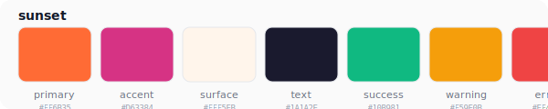 |
| **ocean** - Deep sea blue | 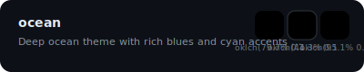 |
| **berry** - Raspberry pink | 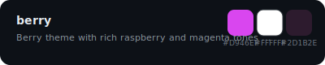 |
| **mint** - Fresh pastel |  |
| **coral** - Friendly peach |  |
| **lavender** - Soft purple |  |

### 🌙 Dark Mode

| Theme | Palette |
|-------|---------|
| **midnight** - True black | 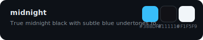 |
| **noir** - High contrast | 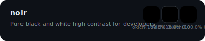 |
| **cyberpunk** - Neon synthwave | 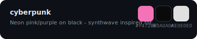 |
| **obsidian** - Dark gray |  |
| **deep-space** - Cosmic void | 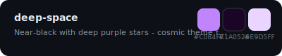 |
| **brutalist** - Stark contrast | 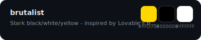 |

### ☀️ Light Mode

| Theme | Palette |
|-------|---------|
| **daylight** - Bright blue | 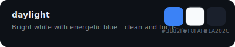 |
| **paper** - Warm off-white | 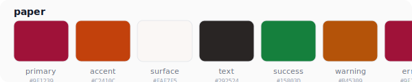 |
| **cream** - Soft cream | 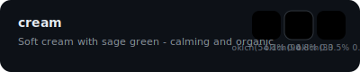 |
| **snow** - Pure white | 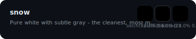 |
| **spring** - Mint + pink | 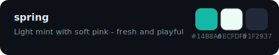 |
| **solar** - Yellow warmth | 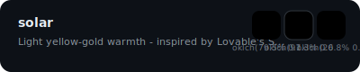 |

### 🌟 Special

| Theme | Palette |
|-------|---------|
| **starry-night** - Van Gogh inspired |  |

**💡 Usage:** Ask your AI assistant: *"Use the cyberpunk theme"* or *"Apply the ocean theme"*

### Using Themes

```css
/* Apply theme */
[data-theme="cyberpunk"] {
  /* All tokens update automatically */
}
```

```typescript
// Switch themes dynamically
document.documentElement.setAttribute('data-theme', 'sunset');
```

---

## 🤖 AI Industry Components

### 1. Chat Interface
Full ChatGPT/Claude-style chat UI:
- Message bubbles with markdown
- Code syntax highlighting
- Streaming indicators
- Copy/regenerate actions

### 2. Prompt Input
Smart prompt component:
- Autocomplete suggestions
- Token counter
- Modifier chips (--ar, --v, --style)

### 3. Agent Cards
AI model/agent displays:
- Status indicators
- Capability tags
- One-click selection

### 4. Thinking Indicators
5 animation styles:
- Bouncing dots
- Wave bars
- Pulse rings
- Shimmer skeletons
- Progress steps

### 5. Code Blocks
Syntax-highlighted code:
- Copy to clipboard
- Download file
- Diff view
- Terminal styling

### 6. File Upload
Drag-and-drop upload:
- Image previews
- Progress bars
- AI context preview

---

## 🎯 Design Tokens

### 100+ Tokens Available

**Colors:**
```css
var(--color-text-default)      /* Primary text */
var(--color-text-muted)        /* Secondary text */
var(--color-surface-raised)    /* Cards */
var(--color-interactive-primary) /* Buttons */
var(--color-status-success)    /* Success states */
```

**Spacing:**
```css
var(--spacing-4)   /* 4px */
var(--spacing-8)   /* 8px */
var(--spacing-16)  /* 16px */
var(--spacing-32)  /* 32px */
```

**Typography:**
```css
var(--font-sans)     /* Geist Sans, Inter */
var(--font-mono)     /* JetBrains Mono */
var(--font-display)  /* Space Grotesk */
```

---

## 🔤 40+ Font Families

### Sans-Serif
- Geist Sans (Vercel's modern geometric)
- Inter (Highly legible)
- Poppins, Plus Jakarta Sans, Satoshi, Manrope, Outfit

### Serif
- Merriweather, DM Serif Display, Lora, Source Serif 4, Literata

### Monospace
- Geist Mono, JetBrains Mono, Fira Code, Cascadia Code, SF Mono, IBM Plex Mono

### Nerd Fonts (Code + Icons)
- JetBrainsMono Nerd Font
- FiraCode Nerd Font
- Hack Nerd Font
- CaskaydiaCove Nerd Font

### Display
- Space Grotesk, Clash Display, Syne, Bungee, Archivo Black

---

## 📦 Installation Methods

### Method 1: npx (Recommended)

```bash
# Auto-detect and install
npx omnidesign

# Install for specific IDE
npx omnidesign install --ide cursor

# Install globally
npx omnidesign install --global
```

### Method 2: npm

```bash
# Install as dev dependency
npm install --save-dev omnidesign

# Or install globally
npm install -g omnidesign

# Then run
omnidesign install
```

**Source:** [github.com/codewithkenzo/omnidesign](https://github.com/codewithkenzo/omnidesign)

### Method 3: bun

```bash
bunx omnidesign
```

---

## 🛠️ CLI Commands

```bash
# Install skill for detected IDE
npx omnidesign install

# Install for specific IDE
npx omnidesign install --ide <ide>

# List supported IDEs and status
npx omnidesign list

# Uninstall skill
npx omnidesign uninstall --ide <ide>

# Show help
npx omnidesign --help
```

---

## 📁 Project Structure

```
omnidesign/
├── 🎨 logo.jpg                 # Brand identity
├── 📖 README.md                # This file
├── 📦 package.json             # NPM manifest
├── 🔧 bin/                     # CLI tools
│   ├── cli.js                 # Main CLI - installs skills
│   ├── install.js             # Install script
│   └── detect-ide.js          # IDE detection
├── 🎯 skills/                  # ⭐ IDE-SPECIFIC SKILLS
│   ├── claude/omnidesign.md   # Claude Code skill
│   ├── cursor/omnidesign.md   # Cursor skill
│   ├── opencode/omnidesign.md # OpenCode skill
│   ├── vscode/package.json    # VS Code extension
│   ├── aider/omnidesign.md    # Aider conventions
│   ├── continue/omnidesign.yaml # Continue.dev config
│   ├── zed/omnidesign.json    # Zed config
│   ├── amp/SKILL.md           # Amp Code skill
│   ├── kilo/SKILL.md          # Kilo Code skill
│   └── antigravity/SKILL.md   # Antigravity skill
├── 🎨 tokens/                  # Design tokens
│   ├── primitives/            # Base values (colors, spacing)
│   ├── semantic/              # Contextual tokens
│   ├── themes/                # 25 theme files
│   └── typography/            # Font collection
├── 📚 recipes/                 # Implementation guides
│   ├── components/            # AI component patterns
│   └── motion/                # Animation system
└── 📦 packages/                # Built outputs
    ├── tokens-css/
    ├── tokens-ts/
    └── react/
```

---

## 🔗 IDE-Specific Instructions

### Claude Code

```bash
npx omnidesign
```

Creates:
- `.claude/skills/omnidesign.md`
- `.claude/marketplace.json`

Use: Type `/omnidesign` or ask "Use OmniDesign theme cyberpunk"

### Cursor

```bash
npx omnidesign
```

Creates:
- `.cursor/skills/omnidesign.md`

Use: OmniDesign prompts appear in AI chat

### OpenCode

```bash
npx omnidesign
```

Creates:
- `.opencode/skills/omnidesign.md`
- Updates `.opencode/config.json`

Use: Skill loads automatically

### VS Code

```bash
npx omnidesign
```

Creates:
- `.vscode/settings.json` with OmniDesign config

Or install from VS Code Marketplace: **"OmniDesign"**

### Zed

```bash
npx omnidesign
```

Creates:
- `.zed/omnidesign.json`

Add to Zed settings to enable the assistant.

### Amp Code

```bash
npx omnidesign
```

Creates:
- `.amp/omnidesign.md`

Amp Code will load the skill automatically.

### Kilo Code

```bash
npx omnidesign
```

Creates:
- `.kilo/omnidesign.md`

Kilo Code will use the skill for design guidance.

### Antigravity

```bash
npx omnidesign
```

Creates:
- `.antigravity/skills/omnidesign.md`

Antigravity will apply the design system conventions.

### Aider

```bash
npx omnidesign
```

Creates:
- `CONVENTIONS.md` with design guidelines

Use: Aider reads conventions automatically

### Continue.dev

```bash
npx omnidesign
```

Creates:
- `.continue/omnidesign.yaml`

Add to `.continue/config.yaml`:
```yaml
context:
  - provider: file
    params:
      file: .continue/omnidesign.yaml
```

---

## 🎓 Usage Examples

### Apply a Theme

```
User: "Use the cyberpunk theme"
AI: [Applies cyberpunk color tokens automatically]
```

### Create a Component

```
User: "Create a button component"
AI: [Generates button using --color-interactive-primary, --spacing-md, etc.]
```

### Build AI Chat UI

```
User: "Build a chat interface"
AI: [Uses AI Chat component patterns with streaming indicators]
```

---

## 📚 Documentation

- **Full Docs**: https://omnidesign.dev
- **Quick Reference**: [QUICKREF.md](./QUICKREF.md)
- **Getting Started**: [GETTING_STARTED.md](./GETTING_STARTED.md)
- **Contributing**: [CONTRIBUTING.md](./CONTRIBUTING.md)

---

## 🤝 Contributing

We welcome contributions! See [CONTRIBUTING.md](./CONTRIBUTING.md) for:

- Adding new themes
- Creating component recipes
- IDE integrations
- Documentation improvements

---

## 📄 License

MIT License - see [LICENSE](./LICENSE)

---

## 🙏 Acknowledgments

- Design tokens following [DTCG specification](https://design-tokens.github.io/)
- Font collection from Google Fonts and Nerd Fonts
- AI components inspired by ChatGPT, Claude, and Midjourney
- Universal skill pattern inspired by Vercel Skills

---

<p align="center">
  <strong>Built with 💙 for the AI coding community</strong>
</p>

<p align="center">
  <strong>OmniDesign Skills System</strong> — Design tokens that travel with your AI
</p>

<p align="center">
  <a href="https://x.com/codewithkenzo">X @codewithkenzo</a> •
  <a href="https://discord.gg/omnidesign">Discord</a> •
  <a href="https://omnidesign.dev">Website</a>
</p>
